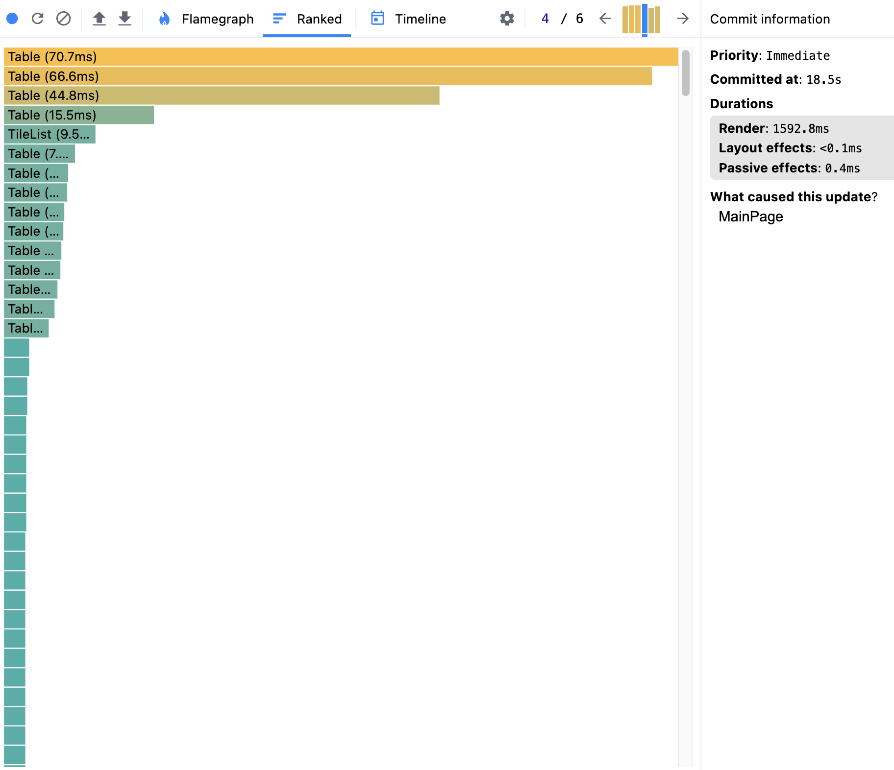
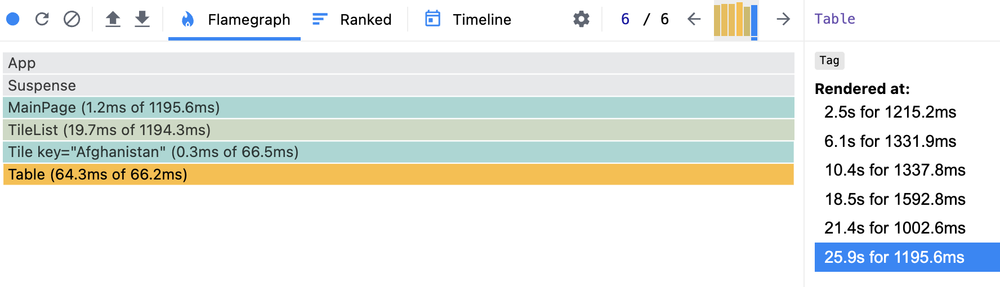

## Performance Profiling (Initial)

**Environment:**  
- Build: `vite dev`  
- Browser: Chrome 127  
- Machine: M1 pro / RAM 16 GB

### Metrics

- **Interactions** — open modal → +`methane`, +`oil_co2` → remove both
- **Commit Duration** — 1592.8 ms
- **Render Duration (per component)** — MainPage 1.2 ms, TileList 19.7 ms, Tile 0.3 ms, Table 64.3 ms
- **Flame Graph** — Table is the heaviest component 
- **Ranked Chart** — Table (70.7 ms), Table (66.6 ms), Table (44.8 ms)...
- **Screenshots**:  
  ()
  
